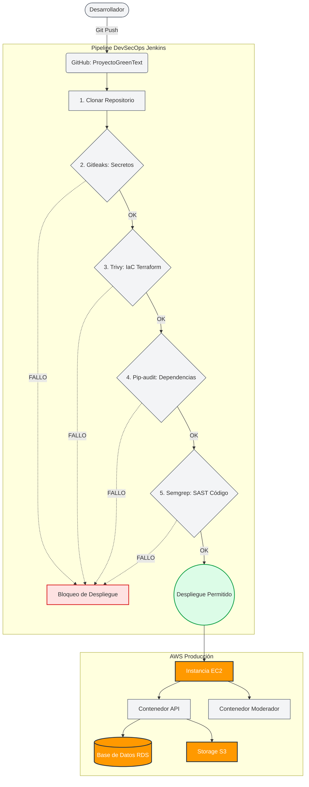

[proyecto_greentext_documentaci_n.md](https://github.com/user-attachments/files/32842247/proyecto_greentext_documentaci_n.md)
# > Proyecto GreenText 

**Proyecto GreenText**, un foro desarrollado que se basa en los famosos greentext de 4chan, agregando votos positivos tipo "Upvotes" como en reddit y la capacidad de dejar comentarios todo desde el anonimato**

---

## 🏗️ Arquitectura y Flujo de Trabajo (DevSecOps)

El ciclo de vida del software en este proyecto está fuertemente protegido por un pipeline de CI/CD en Jenkins, que bloquea cualquier intento de desplegar vulnerabilidades en el entorno de Producción.

A continuación, se muestra el diagrama interactivo de la arquitectura y flujo de validación:



---

## 🛡️ Remediación de Vulnerabilidades (Proyecto Final)

Durante la fase de auditoría final, el pipeline automatizado detuvo el despliegue al encontrar fallos de seguridad críticos. Se aplicaron las siguientes remediaciones de raíz (no parches cosméticos):

### 1. Parche de Código (CWE/XSS)
- **Hallazgo:** Vulnerabilidad detectada en `vista_previa_resena.py` mediante el escáner Semgrep.
- **Remediación:** Se reescribió la lógica del código para sanitizar correctamente las entradas de los usuarios, evitando inyecciones de scripts (XSS).

### 2. Cadena de Suministro (Supply Chain / CVEs)
- **Hallazgo:** `pip-audit` detectó 14 vulnerabilidades de día cero (ej. CVE PYSEC-2026-3552) en librerías heredadas.
- **Remediación:** Se actualizó `requirements.txt` a las versiones seguras verificadas (`requests==2.33.0`, `click==8.3.3`, `cryptography==50.0.0`). 

### 3. Securización del Pipeline de Jenkins
- **Transparencia:** Se eliminaron las reglas `--ignore-vuln` del script `ejecutar.sh` para garantizar que ninguna vulnerabilidad futura pueda ser omitida deliberadamente.
- **Aislamiento Docker:** Para evitar conflictos con la versión antigua de Python del servidor host, se envolvió la ejecución de `pip-audit` dentro de un contenedor efímero (`docker run --rm python:3.10`).
- **Permisos Nativos:** Se asignó al usuario `jenkins` al grupo de Docker de Linux para operar contenedores de forma segura sin requerir contraseñas interactivas (`sudo`).

---

## 🚀 Cómo Ejecutar el Proyecto Localmente

Para levantar el ecosistema completo con la configuración limpia en un entorno de QA local:

```bash
# 1. Clonar el repositorio
git clone https://github.com/TuUsuario/ProyectoGreenText.git
cd ProyectoGreenText

# 2. Construir la imagen con las dependencias sanitizadas
sudo docker-compose up -d --build

# 3. Correr el pipeline de seguridad localmente
chmod +x pipeline/ejecutar.sh
./pipeline/ejecutar.sh
```

Si el script devuelve `VEREDICTO FINAL: PERMITIDO`, la aplicación está libre de vulnerabilidades conocidas y lista para ser promovida a Producción.
